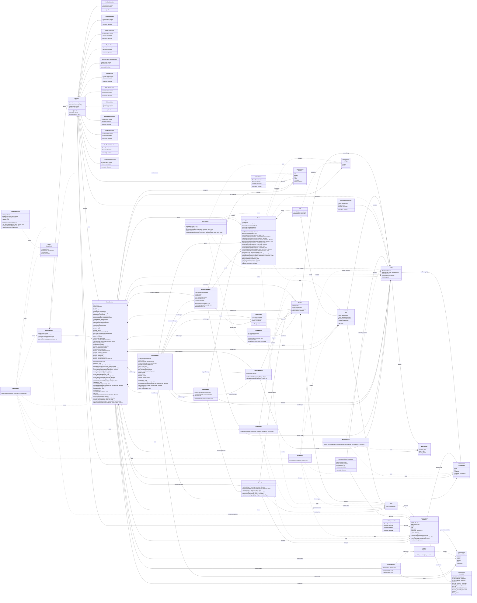

# Диаграмма классов пакета `game`

```mermaid
classDiagram
direction LR

class Player {
  +String name
  +Entity currentEntity
  +MutableList~Item~ inventory
  +Boolean playsAsHuman
}

class Spinner {
  <<object>>
  +getValue(seed Int?) SpinnerValue
}

class SpinnerValue {
  <<enumeration>>
  ESCAPE
  FANGS
  BLADES
  AIM
  +Int number
}

class Card {
  <<abstract>>
  +String cardNameKey
  +String cardDescriptionKey
  -Boolean privateIsFaceDown
  +Boolean isFaceDown
  +flip() Unit
}

class Entity {
  +Boolean isHuman
  +List~DamageType~ canDamagedBy
  +Int healthPoints
  +List~EntityAbility~ abilities
  +Int plusSpeed
}

class Item {
  +ItemType itemType
}

class DamageType {
  <<enumeration>>
  KNIFE
  GUN
  GRENADE
  GRENADE_LAUNCHER
  FANGS
}

class EntityAbility {
  <<enumeration>>
  DOUBLE_HEAL
  START_GUN
  START_KNIFE
}

class ItemType {
  <<enumeration>>
  FIRST_AID_KIT
  WIN_CONDITION
  KNIFE
  GUN
  GRENADE
  GRENADE_LAUNCHER
  +String nameKey
  +String descriptionKey
  +DamageType nullableDamageType
  +List~SpinnerValue~ nullableSpinnerValuesToUse
  +List~GameState~ nullableStatesToUse
  +Boolean isSingleUsable
}

class Board {
  -List cellList
  -List wallList
  +cellExists(coordinates) Boolean
  -getExistCell(coordinates) Cell
  +getCellWithCardCoordinates(card Card) Pair
  +cellHasCondition(coordinates, condition CellType) Boolean
  +wallExists(coordinates, direction Direction) Boolean
  +existCellHasNeighbour(coordinates, direction Direction) Boolean
  -getExistCellExistNeighbour(coordinates, direction Direction) Cell
  +isCardNeighbour(coordinates, card Card) Boolean
  +existCellHasCard(coordinates, card Card) Boolean
  +existCellAddCard(coordinates, card Card) Unit
  +existCellRemoveCard(coordinates, card Card) Unit
  +existCellHasAnyCard(coordinates, cards List~Card~) Boolean
  +existCellAddCards(coordinates, cards List~Card~) Unit
  +move(card Card, direction Direction) Unit
  +hasOpponents(coordinates, playsAsHuman Boolean) Boolean
  +getHighestOpponent(coordinates, playsAsHuman Boolean) Entity
  +hasItems(coordinates) Boolean
  +takeHighestItem(coordinates) Item
  +hasFaceDown(coordinates) Boolean
  +flipFaceDown(coordinates) Unit
  +isEmpty(coordinates) Boolean
  +List~Card~ cardsOnBoard
  +List~Entity~ monstersOnBoard
  +List~Entity~ humansOnBoard
  +List~Entity~ onFinishHumans
}

class Cell {
  +List~CellType~ conditions
  +MutableList~Card~ cards
}

class CellType {
  <<enumeration>>
  START
  FINISH
}

class Direction {
  <<enumeration>>
  UP
  DOWN
  RIGHT
  LEFT
  +Pair delta
  +String nameKey
}

class Action {
  <<abstract>>
  +List~String~ nameKey
  +List~String~ descriptionKey
  -GameContext context
  +Boolean isAvailable
  +execute() Boolean
  +getName() String
  +getDescription() String
}

class ActionManager {
  -GameContext context
  -List~Action~ automaticActions
  -List~Action~ nonautomaticActions
  +Action higherAvailableAutomatic
  +List~Action~ availableNonautomaticList
}

class ChooseMonsterAction {
  -GameContext context
  -Entity monster
  +Boolean isAvailable
  +execute() Boolean
}

class EndBattleAction {
  +GameContext context
  +Boolean isAvailable
  +execute() Boolean
}

class EndGameAction {
  -GameContext context
  +Boolean isAvailable
  +execute() Boolean
}

class FinishTurnAction {
  +GameContext context
  +Boolean isAvailable
  +execute() Boolean
}

class FlipCardAction {
  -GameContext context
  +Boolean isAvailable
  +execute() Boolean
}

class GiveItemToOtherPlayerAction {
  -GameContext context
  -Entity otherPlayerHuman
  -ItemType itemType
  +Boolean isAvailable
  +execute() Boolean
}

class MonsterPlayerTurnSkipAction {
  -GameContext context
  +Boolean isAvailable
  +execute() Boolean
}

class MoveAction {
  -GameContext context
  -Direction direction
  +Boolean isAvailable
  +execute() Boolean
}

class PickUpAction {
  +GameContext context
  +Boolean isAvailable
  +execute() Boolean
}

class SkipAttackAction {
  -GameContext context
  +Boolean isAvailable
  +execute() Boolean
}

class SpinnerAction {
  -GameContext context
  +Boolean isAvailable
  +execute() Boolean
}

class SpinnerSpinnedAction {
  -GameContext context
  +Boolean isAvailable
  +execute() Boolean
}

class StartBattleAction {
  -GameContext context
  +Boolean isAvailable
  +execute() Boolean
}

class UseFirstAidKitAction {
  -GameContext context
  +Boolean isAvailable
  +execute() Boolean
}

class UseWeaponAction {
  +GameContext context
  +ItemType itemType
  +Boolean isAvailable
  +execute() Boolean
}

class UseWinConditionAction {
  +GameContext context
  +Boolean isAvailable
  +execute() Boolean
}

class BoardFactory {
  -getDefaultCellList() List
  -getDefaultWallList() List
  -fillCellListWithDefaultCards(cellList, cardDeck, seed) Unit
  -fillCellListWithPlayerHumans(cellList, humans, seed) Unit
  +createDefaultBoard(humans List~Entity~, deck List~Card~, seed Int?) Board
}

class DeckFactory {
  +createDefaultCardDeck() List~Card~
}

class HumanFactory {
  +createDefaultShuffledHumans(playerCount Int, startHealth Int, seed Int?) List~Entity~
}

class PlayerFactory {
  +createPlayers(names List~String~, humans List~Entity~) List~Player~
}

class GameConfig {
  <<data>>
  +Int playerCount
  +List~String~ playerNames
  +Int startHealth
  +String localization
}

class GameInitialization {
  +Int playerCount
  -MutableList~String~ playerNames
  +List~String~ playerNamesList
  +Int startHealth
  +setPlayerCount(count Int) Int
  +setPlayerName(index Int, name String) String
  +setPlayerStartHealth(health Int) Int
  +buildGameConfig() GameConfig
}

class GameStarter {
  +start(config GameConfig, seed Int?) ActionManager
}

class GameState {
  <<enumeration>>
  MONSTER_CHOOSING
  STEP_SPINNER_SPINNING
  STEP_SPINNER_SPINNED
  STEPPING
  BATTLE_SPINNER_SPINNING
  BATTLE_SPINNER_SPINNED
  BATTLE
  ESCAPE_SPINNER_SPINNING
  ESCAPE_SPINNER_SPINNED
  ESCAPE
  TURN_FINISH
}

class GameContext {
  -Board board
  +String localization
  -Int seed
  +Int playersSize
  -TurnManager turnManager
  -PlayersManager playersManager
  -WinManager winManager
  -InventoryManager inventoryManager
  -MovementManager movementManager
  -HealthManager healthManager
  -BattleManager battleManager
  -SpinnerManager spinnerManager
  +GameState gameState
  +SpinnerValue spinnerValue
  +spin(spinSeed Int?) Unit
  +Int activePlayerIndex
  +nextTurn() Unit
  +incrementWinConditionsCount() Unit
  +Boolean isWin
  +Boolean isLose
  +nonactivePlayerHasEntity(entity Entity) Boolean
  +playerWithEntityAddItem(entity Entity, item Item) Unit
  +List~Entity~ monstersOnBoard
  +List~Entity~ nonactiveHumansOnBoard
  +List~String~ playersNames
  -Player activePlayer
  +String activePlayerName
  +Boolean activePlayerPlaysAsHuman
  +Set~ItemType~ activePlayerInventoryTypesSet
  -Entity activePlayerEntity
  +Int activePlayerHealth
  +Boolean activePlayerEntityIsAlive
  +activePlayerHasAbility(ability EntityAbility) Boolean
  +activePlayerSetEntity(entity Entity) Unit
  +activePlayerAddHealth(count Int) Unit
  +Pair activePlayerCoordinates
  +Int activePlayerStepCount
  +activePlayerStartStepping() Unit
  +activePlayerMove(direction Direction) Unit
  +activePlayerHasItem(type ItemType) Boolean
  +activePlayerRemoveItem(type ItemType) Unit
  +getActivePlayerItemWithType(type ItemType) Item
  +Boolean activePlayerHasOpponent
  +Boolean isStateForStartBattle
  +startBattle() Unit
  +Boolean monsterIsAlive
  +monsterAddHealth(count Int) Unit
  +monsterCanDamagedBy(damageType DamageType) Boolean
  +Boolean isEndBattle
  +goToBattleSpinner() Unit
  +goInBattleState() Unit
  +endBattle() Unit
  +Boolean activePlayerOnItem
  +activePlayerPickUpItem() Unit
  +Boolean activePlayerOnFaceDownCard
  +flip() Unit
  +wallExists(coordinates, direction Direction) Boolean
  +cellExists(coordinates) Boolean
  +cellHasCard(coordinates, card Card) Boolean
  +cellAddCard(coordinates, card Card) Unit
  +cellHasCondition(coordinates, condition CellType) Boolean
  +isEntityNeighbourOfActive(coordinates, entity Entity) Boolean
}

class BattleManager {
  +TurnManager turnManager
  +Board board
  +PlayersManager playersManager
  +MovementManager movementManager
  +HealthManager healthManager
  -Player activePlayer
  -Entity activePlayerEntity
  -Pair activePlayerCoordinates
  +Boolean activePlayerHasOpponent
  +Entity monster
  +Int tempIndex
  +Boolean isActive
  +startBattle() Unit
  +Boolean monsterIsAlive
  +monsterAddHealth(count Int) Unit
  +monsterCanDamagedBy(damageType DamageType) Boolean
  +isEndBattle(spinnerValue SpinnerValue) Boolean
  +endBattle() Unit
  +switchToTempIndex() Unit
}

class HealthManager {
  +PlayersManager playersManager
  +InventoryManager inventoryManager
  +Board board
  +addHealth(entity Entity, count Int) Unit
}

class InventoryManager {
  +hasItem(player Player, type ItemType) Boolean
  +getPlayerItemWithType(player Player, type ItemType) Item
  +addItem(player Player, item Item) Unit
  +removeItem(player Player, type ItemType) Unit
  +getInventoryItems(player Player) List~Item~
  +getInventoryItemTypes(player Player) List~ItemType~
}

class MovementManager {
  +TurnManager turnManager
  +Board board
  -Entity entity
  +Pair currentCoordinates
  +Int currentStepCount
  +Boolean hasSteps
  +move(direction Direction) Unit
  +startStepping(stepCount Int) Unit
  +stopStepping() Unit
}

class PlayersManager {
  +List~Player~ players
  +getPlayerWithEntity(entity Entity) Player
  +getPlayerWithEntityIndex(entity Entity) Int
}

class SpinnerManager {
  +SpinnerValue spinnerValue
  +spin(seed Int?) Unit
  +resetForBattle() Unit
}

class TurnManager {
  +List~Player~ players
  +Int activePlayerIndex
  +Player activePlayer
  +nextTurn() Unit
}

class WinManager {
  +Int winConditionsToWin
  +Int winConditions
  +incrementWinConditions() Unit
  +isWin() Boolean
  +isLose(players List~Player~) Boolean
}

Card <|-- Entity
Card <|-- Item
Action <|-- ChooseMonsterAction
Action <|-- EndBattleAction
Action <|-- EndGameAction
Action <|-- FinishTurnAction
Action <|-- FlipCardAction
Action <|-- GiveItemToOtherPlayerAction
Action <|-- MonsterPlayerTurnSkipAction
Action <|-- MoveAction
Action <|-- PickUpAction
Action <|-- SkipAttackAction
Action <|-- SpinnerAction
Action <|-- SpinnerSpinnedAction
Action <|-- StartBattleAction
Action <|-- UseFirstAidKitAction
Action <|-- UseWeaponAction
Action <|-- UseWinConditionAction

Player "1" --> "1" Entity : currentEntity
Player "1" *-- "0..*" Item : inventory
Entity --> DamageType : canDamagedBy
Entity --> EntityAbility : abilities
Item --> ItemType : itemType
ItemType --> DamageType : damageType
ItemType --> SpinnerValue : spinnerValuesToUse
ItemType --> GameState : statesToUse
Spinner ..> SpinnerValue : returns

Board "1" *-- "many" Cell : cellList
Board ..> Direction : movement
Board ..> CellType : conditions
Board ..> Card : cards
Board ..> Entity : opponents
Board ..> Item : items
Cell "1" o-- "0..*" Card : cards
Cell ..> CellType : conditions

Action --> GameContext : context
ActionManager --> GameContext : context
ActionManager "1" *-- "0..*" Action : actions
ActionManager ..> Direction : creates moves
ActionManager ..> ItemType : creates item actions
ChooseMonsterAction --> Entity : monster
GiveItemToOtherPlayerAction --> Entity : otherPlayerHuman
GiveItemToOtherPlayerAction --> ItemType : itemType
MoveAction --> Direction : direction
UseWeaponAction --> ItemType : itemType

BoardFactory ..> Board : creates
BoardFactory ..> Cell : creates
BoardFactory ..> CellType : uses
BoardFactory ..> Card : places
BoardFactory ..> Entity : places humans
DeckFactory ..> Card : creates
DeckFactory ..> Entity : creates monsters
DeckFactory ..> Item : creates items
DeckFactory ..> ItemType : uses
DeckFactory ..> DamageType : uses
HumanFactory ..> Entity : creates
HumanFactory ..> DamageType : uses
HumanFactory ..> EntityAbility : uses
PlayerFactory ..> Player : creates
PlayerFactory ..> Entity : assigns
PlayerFactory ..> Item : grants start items
PlayerFactory ..> ItemType : uses
GameInitialization ..> GameConfig : builds
GameStarter ..> GameConfig : uses
GameStarter ..> ActionManager : returns
GameStarter ..> HumanFactory : uses
GameStarter ..> PlayerFactory : uses
GameStarter ..> DeckFactory : uses
GameStarter ..> BoardFactory : uses
GameStarter ..> GameContext : creates

GameContext --> Board : board
GameContext --> GameState : gameState
GameContext --> SpinnerValue : spinnerValue
GameContext --> Player : activePlayer
GameContext --> Entity : entities
GameContext --> Item : items
GameContext --> ItemType : inventory
GameContext --> DamageType : damage
GameContext --> EntityAbility : abilities
GameContext --> Direction : movement
GameContext --> Card : board cards
GameContext --> CellType : cell conditions
GameContext *-- TurnManager : turnManager
GameContext *-- PlayersManager : playersManager
GameContext *-- WinManager : winManager
GameContext *-- InventoryManager : inventoryManager
GameContext *-- MovementManager : movementManager
GameContext *-- HealthManager : healthManager
GameContext *-- BattleManager : battleManager
GameContext *-- SpinnerManager : spinnerManager

BattleManager --> TurnManager : turnManager
BattleManager --> Board : board
BattleManager --> PlayersManager : playersManager
BattleManager --> MovementManager : movementManager
BattleManager --> HealthManager : healthManager
BattleManager --> Player : activePlayer
BattleManager --> Entity : monster
BattleManager --> SpinnerValue : battle result
BattleManager --> DamageType : damage type
HealthManager --> PlayersManager : playersManager
HealthManager --> InventoryManager : inventoryManager
HealthManager --> Board : board
HealthManager --> Entity : health target
InventoryManager --> Player : inventory owner
InventoryManager --> Item : inventory item
InventoryManager --> ItemType : item type
MovementManager --> TurnManager : turnManager
MovementManager --> Board : board
MovementManager --> Direction : direction
MovementManager --> Entity : moving entity
PlayersManager --> Player : players
PlayersManager --> Entity : lookup
SpinnerManager --> Spinner : spin source
SpinnerManager --> SpinnerValue : value
TurnManager --> Player : players
WinManager --> Player : lose check
```
