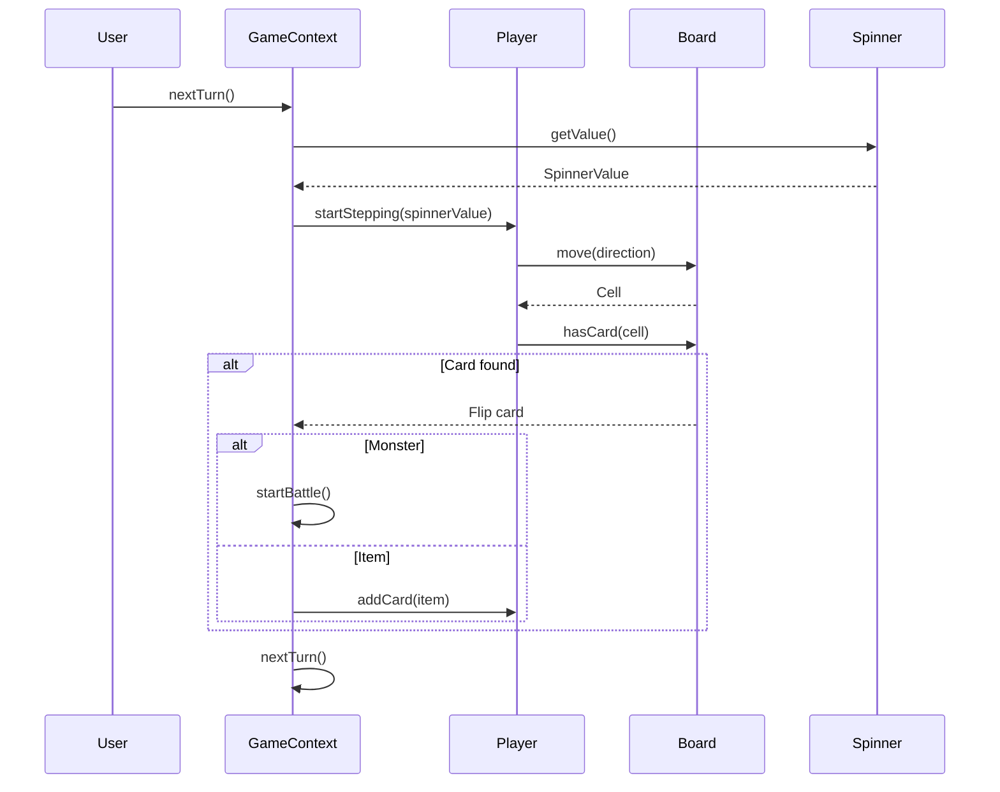
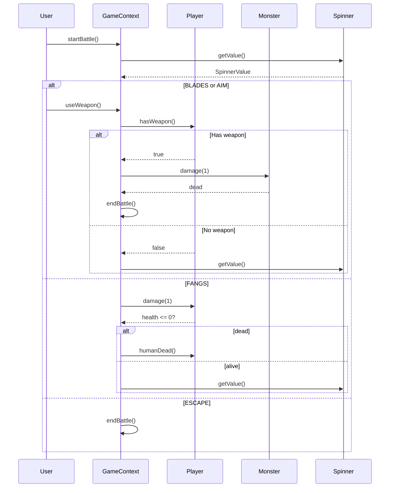

# Диаграмма классов проекта «Побег из дома зомби»

## Общая диаграмма

```mermaid
classDiagram
    %% Core Game Control
    class GameContext {
        -Board board
        -List~Player~ players
        -String localization
        -int activePlayerIndex
        -SpinnerValue spinnerValue
        +var gameState: GameState
        +nextTurn()
        +activePlayerHasCard(card: Card): Boolean
        +activePlayerAddCard(card: Card)
        +activePlayerRemoveCard(card: Card)
        +activePlayerAddHealth(count: Int)
        +activePlayerEntityIsAlive: Boolean
        +activePlayerMove(direction: Direction)
        +activePlayerHasOpponent: Boolean
        +startBattle()
        +cellHasCondition(coordinates, condition): Boolean
        +cellAddCard(coordinates, card)
        +cellRemoveCard(coordinates, card)
        +spin()
        +spinnerValue: SpinnerValue
        +activePlayerCoordinates: Pair~Int, Int~
        +activePlayerPreviousCoordinates: Pair~Int, Int~?
        +activePlayerPlaysAsHuman: Boolean
        +monsterIsAlive: Boolean
        +monsterCanDamagedBy(damageType): Boolean
        +monsterAddHealth(count: Int)
        +incrementWinConditionsCount()
        +endBattle()
        +isEndBattle: Boolean
    }

    class GameState {
        <<enumeration>>
        MONSTER_CHOOSING
        STEP_SPINNER_SPINNING
        STEP_SPINNER_SPINNED
        STEPPING
        BATTLE_SPINNER_SPINNING
        BATTLE_SPINNER_SPINNED
        BATTLE
        PLANKS_BREAKING_SPINNER_SPINNING
        PLANKS_BREAKING_SPINNER_SPINNED
        PLANKS_BREAKING
        TURN_FINISH
    }

    class GameConfig {
        +int playerCount
        +List~String~ playerNames
        +int startHealth
        +String localization
    }

    class GameStep {
        -GameContext context
    }

    %% Board and Cells
    class Board {
        -List~List~Cell~~ cellList
        -List~Pair~Pair~Int, Int~~, Pair~Int, Int~~~ wallList
        +cellExists(coordinates: Pair~Int, Int~): Boolean
        +cellWithCardExists(card: Card): Boolean
        +getExistCellWithCardCoordinates(card: Card): Pair~Int, Int~
        +cellHasCondition(coordinates, condition): Boolean
        +wallExists(coordinates1, coordinates2): Boolean
        +existCellHasNeighbour(coordinates, direction): Boolean
        +existCellHasCard(coordinates, card): Boolean
        +existCellAddCard(coordinates, card)
        +existCellRemoveCard(coordinates, card)
        +move(card: Card, direction: Direction)
        +hasOpponents(coordinates, playsAsHuman): Boolean
        +getHighestOpponent(coordinates, playsAsHuman): Entity?
    }

    class Cell {
        -List~CellCondition~ conditions
        -MutableList~Card~ cards
        +hasCondition(condition): Boolean
        +hasCard(card): Boolean
        +addCard(card)
        +removeCard(card)
        +hasMonsters: Boolean
        +hasHumans: Boolean
        +hasItems: Boolean
        +hasPlanks: Boolean
        +hasFaceDown: Boolean
        +existHighestMonster: MonsterEntity
        +existHighestHuman: HumanEntity
        +existHighestItem: Item
        +breakPlanks()
        +flipFaceDown()
    }

    class CellCondition {
        <<enumeration>>
        START
        FINISH
        SEALABLE
    }

    class Direction {
        <<enumeration>>
        UP
        DOWN
        LEFT
        RIGHT
        +delta: Pair~Int, Int~
        +nameKey: String
    }

    class Spinner {
        <<object>>
        +getValue(): SpinnerValue
    }

    class SpinnerValue {
        <<enumeration>>
        ESCAPE(1)
        FANGS(2)
        BLADES(3)
        AIM(4)
        +number: Int
    }

    %% Players and Entities
    class Player {
        +String name
        +Entity currentEntity
        -int currentStepCount
        +playsAsHuman: Boolean
        +move(board: Board, direction: Direction)
        +startStepping(spinnerValue: SpinnerValue)
        +startBattle()
        +humanDead(): List~Card~
    }

    class Entity {
        <<abstract>>
        +String cardNameKey
        +String cardDescriptionKey
        +List~DamageType~ canDamagedBy
        -int _healthPoints
        +List~EntityAbility~ abilities
        +int plusSpeed
        +isAlive: Boolean
        +healthPoints: Int
        +addHealth(count: Int, board: Board)
    }

    class HumanEntity {
        -MutableList~Card~ inventory
        +hasCard(card): Boolean
        +addCard(card)
        +removeCard(card)
        +cards: List~Card~
    }

    class MonsterEntity {
        +int plusSpeed
    }

    class EntityAbility {
        <<enumeration>>
        SPRINT
        DOUBLE_HEAL
    }

    class DamageType {
        <<enumeration>>
        KNIFE
        GUN
        GRENADE
        GRENADE_LAUNCHER
        FANGS
    }

    class DefaultValues {
        <<object>>
    }

    %% Cards System
    class Card {
        <<abstract>>
        +String cardNameKey
        +String cardDescriptionKey
        -Boolean _isFaceDown
        +isFaceDown: Boolean
        +flip()
    }

    class Item {
        <<abstract>>
        +isUsageAvailable(context: GameContext): Boolean
        +use(context: GameContext): Boolean
    }

    class WeaponItem {
        +DamageType damageType
        +List~SpinnerValue~ spinnerValuesToUse
        +List~GameState~ statesToUse
        +isUsageAvailable(context): Boolean
        +use(context): Boolean
    }

    class PlanksItem {
        +isUsageAvailable(context): Boolean
        +use(context): Boolean
    }

    class FirstAidKitItem {
        +isUsageAvailable(context): Boolean
        +use(context): Boolean
    }

    class FuelCanisterItem {
        +isUsageAvailable(context): Boolean
        +use(context): Boolean
    }

    class CarKeyItem {
        +isUsageAvailable(context): Boolean
        +use(context): Boolean
    }

    class Planks {
        +Planks()
    }

    %% Actions System
    class Action {
        <<abstract>>
        +String nameKey
        +String descriptionKey
        -GameContext context
        +isAvailable: Boolean
        +action(): Boolean
        +getName(): String
        +getDescription(): String
    }

    class MoveAction {
        -GameContext context
        -Direction direction
        +isAvailable: Boolean
        +action(): Boolean
    }

    class StartBattleAction {
        -GameContext context
        +isAvailable: Boolean
        +action(): Boolean
    }

    class UseItemAction {
        -GameContext context
        -Item item
        +isAvailable: Boolean
        +action(): Boolean
    }

    class SpinnerAction {
        -GameContext context
        +isAvailable: Boolean
        +action(): Boolean
    }

    class SpinnerSpinnedAction {
        -GameContext context
        +isAvailable: Boolean
        +action(): Boolean
    }

    class FlipCardAction {
        -GameContext context
        +isAvailable: Boolean
        +action(): Boolean
    }

    class EndBattleAction {
        -GameContext context
        +isAvailable: Boolean
        +action(): Boolean
    }

    class DeadAction {
        -GameContext context
        +isAvailable: Boolean
        +action(): Boolean
    }

    class ChooseMonsterAction {
        -GameContext context
        -MonsterEntity monster
        +isAvailable: Boolean
        +action(): Boolean
    }

    class GiveItemToOtherPlayerAction {
        -GameContext context
        +isAvailable: Boolean
        +action(): Boolean
    }

    class FinishTurnAction {
    }

    class DriveOnCarAction {
    }

    class ActionManager {
        -GameContext context
        -boolean isBattle
        -List~Action~ automaticActions
        -List~Action~ nonautomaticActions
        +higherAvailableAutomaticName: String?
        +availableNonautomaticNameList: List~String~
        +useAction(actionName: String): Boolean
    }

    %% Factories
    class BoardFactory {
        -List~Card~ defaultCardDeck
        +createDefaultBoard(humans: List~HumanEntity~): Board
    }

    class HumanFactory {
        +createDefaultHumans(playerCount: Int, startHealth: Int): List~HumanEntity~
    }

    class PlayerFactory {
        +createPlayers(names: List~String~, humans: List~HumanEntity~): List~Player~
    }

    class GameInitialization {
        -int playerCount
        -List~String~ playerNames
        -int startHealth
        +setPlayerCount(count: Int): Int
        +setPlayerName(index: Int, name: String): String
        +setPlayerStartHealth(health: Int): Int
        +buildGameConfig(): GameConfig
    }

    class GameStarter {
        +start(config: GameConfig): GameStep
    }

    %% Relationships
    GameContext --> Board
    GameContext --> Player
    GameContext --> GameState
    GameContext --> SpinnerValue

    Board --> Cell
    Cell --> Card
    Cell --> CellCondition

    Player --> Entity
    Entity <|-- HumanEntity
    Entity <|-- MonsterEntity
    HumanEntity o-- Card

    Card <|-- Item
    Card <|-- Planks
    Item <|-- WeaponItem
    Item <|-- PlanksItem
    Item <|-- FirstAidKitItem
    Item <|-- FuelCanisterItem
    Item <|-- CarKeyItem

    Action <|-- MoveAction
    Action <|-- StartBattleAction
    Action <|-- UseItemAction
    Action <|-- SpinnerAction
    Action <|-- SpinnerSpinnedAction
    Action <|-- FlipCardAction
    Action <|-- EndBattleAction
    Action <|-- DeadAction
    Action <|-- ChooseMonsterAction
    Action <|-- GiveItemToOtherPlayerAction
    Action <|-- FinishTurnAction
    Action <|-- DriveOnCarAction

    ActionManager --> Action

    BoardFactory ..> Board : creates
    BoardFactory ..> Cell : creates
    HumanFactory ..> HumanEntity : creates
    PlayerFactory ..> Player : creates
    GameStarter ..> GameStep : creates

    Entity --> DamageType
    Entity --> EntityAbility

    GameInitialization ..> GameConfig : creates
    GameStep --> GameContext
```

## Схемы взаимодействия

### Основной игровой цикл

### Боевая система

## Ключевые зависимости

| Класс | Зависит от | Назначение |
|-------|------------|------------|
| GameContext | Board, Player, GameState | Центральный контроллер игры |
| Board | Cell, CellCondition | Управление игровым полем |
| Player | Entity | Представление игрока |
| Entity | DamageType, EntityAbility | Базовая сущность (человек/монстр) |
| Card | - | Базовая карта |
| Item | GameContext | Предметы и оружие |
| Action | GameContext | Действия игрока |
| ActionManager | Action | Управление доступными действиями |
| BoardFactory | Board, Cell | Создание игрового поля |
| HumanFactory | HumanEntity | Создание персонажей |
| PlayerFactory | Player | Создание игроков |
| GameStarter | GameContext, GameStep | Запуск игры |
| GameInitialization | GameConfig | Инициализация конфигурации |

## Примечания

1. **Паттерны проектирования:**
   - **State** — `GameState` управляет состояниями игры
   - **Command** — `Action` инкапсулирует действия игроков
   - **Factory** — `BoardFactory`, `HumanFactory`, `PlayerFactory` создают объекты

2. **Состояния игры:**
   - `MONSTER_CHOOSING` — выбор монстра для атаки (для убитых игроков)
   - `STEP_SPINNER_SPINNING/SPINNED` — вращение вертушки для хода
   - `STEPPING` — перемещение по полю
   - `BATTLE_SPINNER_SPINNING/SPINNED` — вращение вертушки в бою
   - `BATTLE` — выбор действия в бою
   - `PLANKS_BREAKING_SPINNER_SPINNING/SPINNED` — вращение для разрушения досок
   - `PLANKS_BREAKING` — разрушение досок
   - `TURN_FINISH` — завершение хода

3. **Типы урона:**
   - `KNIFE` — холодное оружие (нож, арбалет, топор)
   - `GUN` — огнестрельное оружие (пистолет, автомат, дробовик)
   - `GRENADE` — граната
   - `GRENADE_LAUNCHER` — гранатомёт (только для босса)
   - `FANGS` — урон от монстров

4. **Значения вертушки:**
   - `ESCAPE` — побег из боя (шанс 30%)
   - `FANGS` — атака монстра (шанс 30%)
   - `BLADES` — атака холодным оружием (шанс 20%)
   - `AIM` — атака огнестрельным оружием (шанс 20%)

5. **Способности персонажей:**
   - `SPRINT` — добавляет +1 к перемещению (Макс)
   - `DOUBLE_HEAL` — аптечка восстанавливает 2 жизни вместо 1 (Настя)

6. **Персонажи:**
   - Карате-кид (Саша) — начинает с ножом
   - Медсестра (Настя) — двойное лечение
   - Беглец (Макс) — +1 скорость
   - Полицейский (Надя) — начинает с пистолетом
   - Атлет (Борис) — +2 начальных жизни
